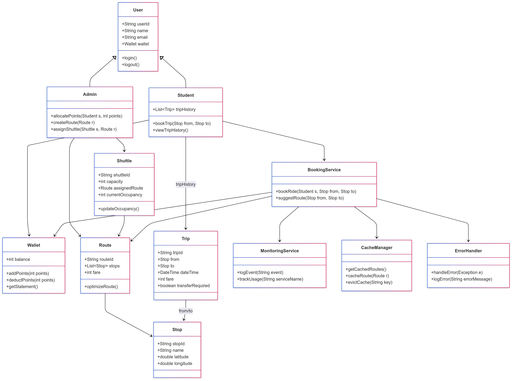
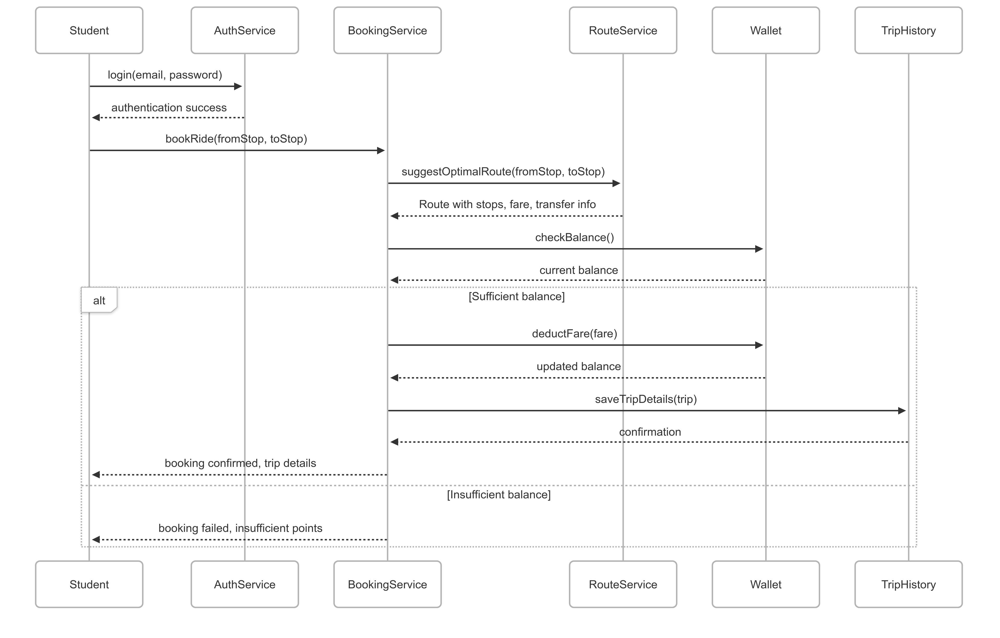

# 🚍 Shuttle Management System

A **Smart Campus Transit Solution** built using **Spring Boot**, offering shuttle booking, digital fare management, route optimization, and trip tracking for university students.

---

## Features Implemented

### 👥 Student Features
- **Login with JWT authentication**
- **Profile registration** via email
- **Digital Wallet** with fare deduction
- **Trip Booking** between any two stops
- **Trip History** with fare tracking

### 🛠️ Admin Features
- **Create/Manage Stops and Routes**
- **Assign Points to Student Wallets**
- **Dashboard Summary**
  - Total students, trips today, fare used/distributed, etc.

### 📊 Reporting
- **Student Dashboard Report** (via API)
- **Fare auto-deduction logic**

### ✅ Technical Highlights
- **Spring Boot + JPA**
- **REST APIs** with secured access
- **Global Exception Handling**
- **Object-Oriented Architecture** (Services, Repositories, Controllers)

---
## 🧭 System Architecture

###  Class Diagram



###  Sequence Diagram

---

## 📦 API Endpoints

### 🔐 Authentication
```bash
POST /api/auth/login
```

### 👥 Student APIs
```bash
POST /api/students
GET /api/students
```

### 💳 Wallet
```bash
PATCH /api/wallet/{id}/add
```

### 🚌 Stops & Routes
```bash
POST /api/stops
POST /api/routes
GET /api/stops
GET /api/routes
```

### 🚀 Trip Booking
```bash
POST /api/trips/book?studentId=1&fromStopId=1&toStopId=2&fare=10
GET /api/trips/student/{studentId}
GET /api/trips/student/{studentId}/total-fare
```

### 📊 Admin Dashboard
```bash
GET /api/admin/dashboard/summary
```
---
## H2 Database Console

To access the H2 in-memory database (for demo or testing):

1. Start the Spring Boot application.
2. Visit [http://localhost:8080/h2-console](http://localhost:8080/h2-console)
3. Use the following credentials:

   - **JDBC URL**: `jdbc:h2:file:./data/shuttledb`
   - **Username**: `sa`
   - **Password**: (leave blank)

4. Click **Connect** to view tables like `student`, `wallet`, `trip`, `stop`, and more.


---
## 1. Student Registration & Wallet Creation (via DB / H2)
>  No API currently — done manually via SQL for demo

```sql
-- Insert wallet for student
INSERT INTO wallet (id, balance) VALUES (1, 1000);

-- Register student with wallet
INSERT INTO student (id, name, email, wallet_id) VALUES (1, 'Alice', 'alice@university.edu', 1);
```
---
## 🧪 2. Testing with curl

### Login (Get JWT Token)
```bash
curl -X POST http://localhost:8080/api/auth/login   -H "Content-Type: application/json"   -d '{ "email": "alice@university.edu" }'
```
**Response**:

```json
{
  "token": "xxehbGxx..."
}
```

---

## 3. Stops Management

###  Create a stop

```bash
curl -X POST http://localhost:8080/api/stops \
  -H "Content-Type: application/json" \
  -H "Authorization: Bearer <your_token>" \
  -d '{"name": "Main Gate", "latitude": 28.6129, "longitude": 77.2295}'
```

###  Get all stops

```bash
curl -X GET http://localhost:8080/api/stops \
  -H "Authorization: Bearer <your_token>"
```

---

## 4.   Route Management 

### Create a route 

```bash
curl -X POST http://localhost:8080/api/routes \
  -H "Content-Type: application/json" \
  -H "Authorization: Bearer <your_token>" \
  -d '{"name": "Campus Loop", "stopIds": [1, 2, 3]}'
```

---

## 5. Trip Booking

### Book a trip (success case)

```bash
curl -X POST "http://localhost:8080/api/trips/book?studentId=1&fromStopId=1&toStopId=2&fare=10" \
  -H "Authorization: Bearer <your_token>"
```

###  Book trip with insufficient balance (failure case)

```bash
curl -X POST "http://localhost:8080/api/trips/book?studentId=1&fromStopId=1&toStopId=2&fare=1000" \
  -H "Authorization: Bearer <your_token>"
```

 **Response**:

```json
{ "error": "Insufficient wallet balance" }
```

---

## 6. Trip History & Fare Usage

###  Get all trips for a student

```bash
curl -X GET http://localhost:8080/api/trips/student/1 \
  -H "Authorization: Bearer <your_token>"
```

###  Get total fare used by student

```bash
curl -X GET http://localhost:8080/api/trips/student/1/total-fare \
  -H "Authorization: Bearer <your_token>"
```

---

## 📊 7. Admin Dashboard Summary

###  Get full system dashboard stats

```bash
curl -X GET http://localhost:8080/api/admin/dashboard/summary \
  -H "Authorization: Bearer <your_token>"
```

 **Response**:

```json
{
  "totalStudents": 1,
  "totalRoutes": 0,
  "totalStops": 2,
  "totalTripsToday": 1,
  "pointsDistributedThisMonth": 990,
  "pointsUsedThisMonth": 10
}
```

---

##  8. Error Handling Demo

###  Call trip booking with invalid student ID

```bash
curl -X POST "http://localhost:8080/api/trips/book?studentId=999&fromStopId=1&toStopId=2&fare=10" \
  -H "Authorization: Bearer <your_token>"
```

 **Response**:

```json
{ "error": "Student not found" }
```

---

##  Notes

* Replace `<your_token>` with your actual JWT token from the login response.
* All `POST` endpoints require `-H "Content-Type: application/json"` for JSON body.
* You can use `H2 Console` at `http://localhost:8080/h2-console` to verify DB changes.

---

##  Technologies Used

- **Java 17**
- **Spring Boot 3.5**
- **Spring Security (JWT)**
- **Hibernate + JPA**
- **H2 Database**
- **Postman / curl** for testing

---

##  Future Enhancements

- AI-based stop suggestions
- Multi-leg route planning
- PDF/CSV export of trip logs
- Fare pricing based on distance/peak hours
- Cache optimization
- System monitoring with Spring Boot Actuator

---

